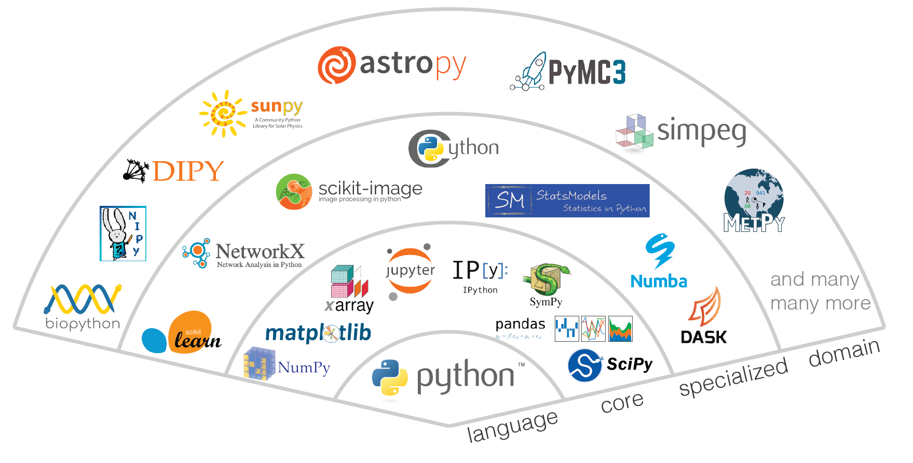

# The Python EM Ecosystem

This chapter gives a brief overview of some packages in common use in the scientific Python ecosystem and with EM
analyses specifically.

## Scientific Python Core Packages

This figure [^fig-ref] gives a general overview of the interdependencies between the most crucial packages of the
scientific Python ecosystem.

Used by almost every project indirectly, and also often directly, the core packages can be seen. Of these **Numpy** is
the most important. It provides a way of interacting and performing basic mathematical operations on *arrays*
(something which Python itself great at). A great many packages require Numpy themselves and this is therefore found
in almost every project. When doing any scientific programming in Python, the Numpy
[docs](https://numpy.org/doc/stable/reference/routines.html) will need to be consulted very regularly. 

**Matplotlib** is the de-facto default plotting library in Python. Like Numpy, Matplotlib will be required both
directly and indirectly by almost every project and the
[docs](https://matplotlib.org/stable/api/index.html) will be needed very regularly too. They helpfully also provide
[cheatsheets](https://matplotlib.org/cheatsheets/).

**Scipy** is another core package. This contains more complex mathematical algorithms such as linear algebra, fourier
transforms and integration to name a few. Their documentation is [here](https://docs.scipy.org/doc/scipy/reference/).

## Relevant Specialised Packages

More specialised packages frequently used for EM analysis tasks include **scikit-image** and **scikit-learn** which
contain algorithms in common use for image-processing and machine-learning respectively. Their documentation can be
found [here](https://scikit-image.org/docs/stable/api/api.html) and
[here](https://scikit-learn.org/stable/api/index.html). In particular scikit-learn has excellent guides on selecting
which machine-learning tool to use. 

All the above libraries are in extremely frequent use in all fields of scientific Python and therefore their
documentation is excellent.

Other specialised packages used in the EM community include [Dask](https://www.dask.org/) for running algorithms on
clusters or out-of-memory, [Numba](https://numba.pydata.org/) for compiling small sections of Python to increase speed
and [CuPy](https://cupy.dev/) for running algorithms on CUDA GPUs. These are all concerned with making array
manipulation faster than could be otherwise be achieved with Numpy, at the expense of complexity. Don't use unless
the algorithm is taking days. They all follow Numpy's API so closely that their documentation is largely
copy-and-pasted from the Numpy docs.

## EM Specific Packages

Almost every EM analysis project will make use of **hyperspy** which contains tools for opening microscope files and
manipulating them. It not only works with images but also spectral maps such as EDS and EELS maps. Hyperspy contains
extensive guides and examples. The team also conducts workshops/tutorials. While familiarity with the previously
mentioned tools will develop naturally through exposure, it is strongly recommended to follow guides for Hyperspy
as it is the foundation for all EM analysis in Python. Their docs can be found
[here](https://hyperspy.readthedocs.io/en/stable/).

### Multislice simulation

For multislice simulations, **abTEM** can be used. It integrates with **ase** which is used to create synthetic models
of samples which are then passed to abTEM to be simulated in the TEM's electron beam. Their docs are 
[here](https://abtem.readthedocs.io/en/latest/intro.html) and [here](https://wiki.fysik.dtu.dk/ase/ase/atoms.html).

### 4D STEM

Finally, for 4D STEM processing there are several popular Python packages. **py4DSTEM**
([docs](https://py4dstem.readthedocs.io/en/latest/index.html)) and **pyxem**
([docs](https://pyxem.readthedocs.io/en/stable/)) both provide hyperspy-like ways of performing complex 4D STEM
analyses.

**LiberTEM** instead tries to make it as easy as possible to perform simpler 4D STEM analyses, using a graphical
user-interface ([docs](https://libertem.github.io/LiberTEM/))

[^fig-ref]: Figure adapted from a 2015 presentation by Jake Vanderplas.
